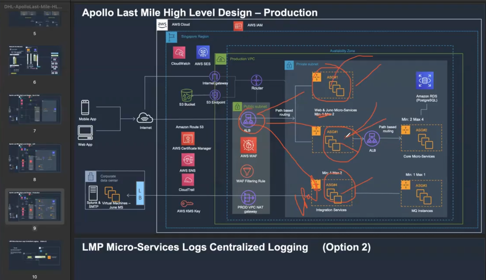
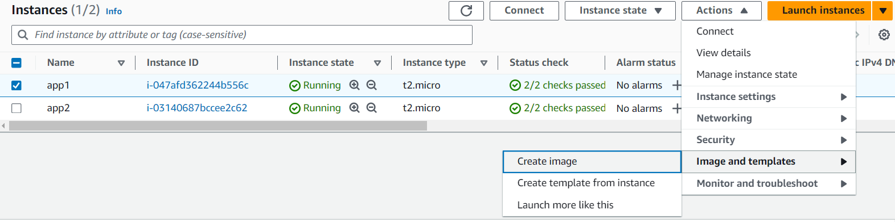
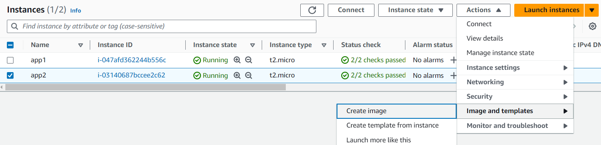

### Autoscaling aws realtime example 

Hi-availability :-

* Autoscaling
* Lifecycle Hook
* Instance Managemant
* Load Balancer

Types of backups:-

1. snapshot = Volume
2. MYAMI = OS + Volume

Launch Configuration :-

* MYAMI + H/W

steps:-
1. create Vpc in london region with sg tcp linux protocol=ssh port 22,windows protocol=rdp port=3389,http tcp custom rules
2. Create Two Testing Servers app1,app2
   * Download remote desktop file and install and open server1
     1. Computer : Host-ip 
     2. Username: Administrator
     3. Password:***** or upload private key file and click dycript then we'll get password
     4. click on windows icon and click on server-manager option and on the console Dashboard--> click on add-roles and features
        -->3 times click Next button and select IIS-WEB_SERVER and click Next --> click install-button and wait untill it will finish. and --> click close-button.
     5. open c:drive --> inetpub-->wwwroot = C:\inetpub\wwwroot file this.
     6. create one folder name APP1 and paste project all folders
     7. access via public-ip:80/app1

   * Download remote desktop file and install and open server2
     1. Computer : Host-ip 
     2. Username: Administrator
     3. Password:***** or upload private key file and click dycript then we'll get password
     4. click on windows icon and click on server-manager option and on the console Dashboard--> click on add-roles and features
        -->3 times click Next button and select IIS-WEB-SERVER and click add-features and click Next 4 times --> click install-button and wait untill it will finish. and --> click close-button.
     5. open c:drive --> inetpub-->wwwroot = C:\inetpub\wwwroot file this.
     6. create one folder name APP2 and paste project all folders
     7. access via public-ip:80/app2
    
     Example: bellow Diagram

      

3. Create An Images From Testing Servers
 
   * Now create MYAMI from APP1-SERVER
     
     * MYAMI is Nothing but combination of OS + Volume like this MYAMI=OS+vulume

    follow diagram:-

       

    steps:
     
    go to console: when Click on create-image from app1
      
       Image name: APP1
       
       Image description : Used For App-01

       Tag:- key: Name  Value: Service1-From-app1
    
    follow diagram:-

      

    steps:

    go to console: when Click on create-image fronm app2
      
       Image name: APP2
       
       Image description : Used For App-02

       Tag:- key: Name  Value: Service1-From-app2
    