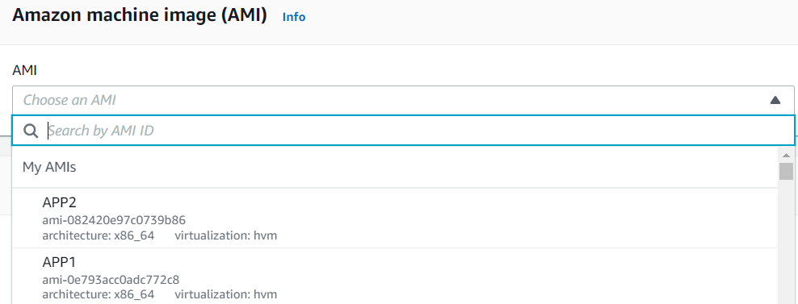
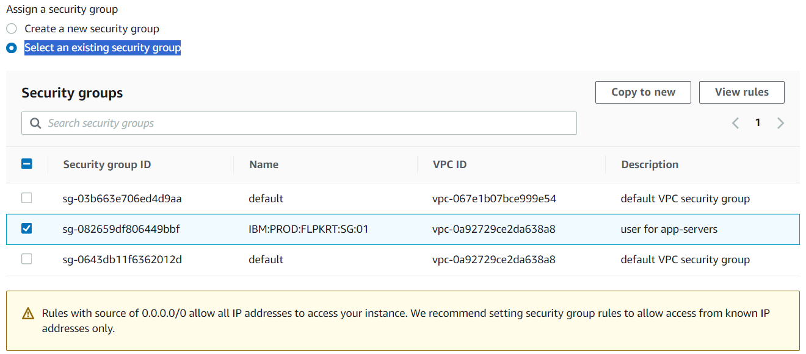

### Autoscaling aws realtime example 

Hi-availability :-

* Autoscaling
* Lifecycle Hook
* Instance Managemant
* Load Balancer

Types of backups:-

1. snapshot = Volume
2. MYAMI = OS + Volume

Launch Configuration :-

* MYAMI + H/W

steps:-
1. create Vpc in london region with sg tcp linux protocol=ssh port 22,windows protocol=rdp port=3389,tcp protocol=http  port 80       custom  rules
2. Create Two Testing Servers app1,app2
   * Download remote desktop file and install and open server1
     1. Computer : Host-ip 
     2. Username: Administrator
     3. Password:***** or upload private key file and click dycript then we'll get password
     4. click on windows icon and click on server-manager option and on the console Dashboard--> click on add-roles and features
        -->3 times click Next button and select IIS-WEB_SERVER and click Next --> click install-button and wait untill it will finish. and --> click close-button.
     5. open c:drive --> inetpub-->wwwroot = C:\inetpub\wwwroot file this.
     6. create one folder name APP1 and paste project all folders
     7. access via public-ip:80/app1

   * Download remote desktop file and install and open server2
     1. Computer : Host-ip 
     2. Username: Administrator
     3. Password:***** or upload private key file and click dycript then we'll get password
     4. click on windows icon and click on server-manager option and on the console Dashboard--> click on add-roles and features
        -->3 times click Next button and select IIS-WEB-SERVER and click add-features and click Next 4 times --> click install-button and wait untill it will finish. and --> click close-button.
     5. open c:drive --> inetpub-->wwwroot = C:\inetpub\wwwroot file this.
     6. create one folder name APP2 and paste project all folders
     7. access via public-ip:80/app2
    
     Example: bellow Diagram

      

3. Create An Images From Testing Servers
 
   * Now create MYAMI from APP1-SERVER
     
     * MYAMI is Nothing but combination of OS + Volume like this MYAMI=OS+vulume

    follow diagram:-

       

    steps:
     
    go to console: when Click on create-image from app1
      
       Image name: APP1
       
       Image description : Used For App-01

       Tag:- key: Name  Value: Service1-From-app1
    
    follow diagram:-

      

    steps:

    go to console: when Click on create-image fronm app2
      
       Image name: APP2
       
       Image description : Used For App-02

       Tag:- key: Name  Value: Service1-From-app2

4. Launch Configuration :-
   
   ## For APP1:

    go to Launch configuration console : configure all bellow things
     
      Launch configuration name : APP1
        

      Amazon Michine Image : this AMI which we have created (AMI name: APP1)

      Instance Type : m4.large

      Additional configuration: (optional)
        
         * purchasing option: if you want any spot instances should anable

         * IAM instance profile: it is very importent when capture ec2 applicatiion logs and network logs and cpu metrics ,memory metrics then pushed to s3 bucket. in that cause we can write shell or python scripts and monitor the logs. for that we have to create IAM role and  then place here.

         *  monitoring :
            
            [*] Enable EC2 instance detailed monitoring within CloudWatch.

         * EBS-optimized instance

            [*] Launch as EBS-optimized instance
         
         * Advance Details :

            user data: if we want any customization

      Storage (volumes) :

         * EBS volumes: if we want add.

      Security groups :

         Assign a security group : Select an existing security group.

      

      Key pair (login) :

         Key pair options : Choose an existing key pair.

         existing key pair : which one you have already in this region. 

   ## For APP2:

    go to Launch configuration console : configure all bellow things
     
      Launch configuration name : APP2
        

      Amazon Michine Image : this AMI which we have created (AMI name: APP1)

      Instance Type : m4.large

      Additional configuration: (optional)
        
         * purchasing option: if you want any spot instances should anable

         * IAM instance profile: it is very importent when capture ec2 applicatiion logs and network logs and cpu metrics ,memory metrics then pushed to s3 bucket. in that cause we can write shell or python scripts and monitor the logs. for that we have to create IAM role and  then place here.

         *  monitoring :
            
            [*] Enable EC2 instance detailed monitoring within CloudWatch.

         * EBS-optimized instance

            [*] Launch as EBS-optimized instance
         
         * Advance Details :

            user data: if we want any customization

      Storage (volumes) :

         * EBS volumes: if we want add.

      Security groups :

         Assign a security group : Select an existing security group.

      

      Key pair (login) :

         Key pair options : Choose an existing key pair.

         existing key pair : which one you have already in this region.   
          
5. Target Group For APP1,APP2
   
   ### FOR APP1 Target-group

    go to target group console:
      
      Specify group details :

        * Basic configuration:
         
          Choose a target type: [select]

          Target group name: APP1

          Protocol : http and port : 80

          IP address type : [select] IPv4

          VPC : select which we have created vpc

          Protocol version: select HTTP1
        
        * Health checks :

          Health check protocol : HTTP

          Health check path : /path1 

          and click NEXT-BUTTON then click CREATE-TARGET-GROUP
   
   ### FOR APP2 Target-group

    go to target group console:
      
      Specify group details :

        * Basic configuration:
         
          Choose a target type: [select]

          Target group name: APP1

          Protocol : http and port : 80

          IP address type : [select] IPv4

          VPC : select which we have created vpc

          Protocol version: select HTTP1
        
        * Health checks :

          Health check protocol : HTTP

          Health check path : /path2 

          and click NEXT-BUTTON then click CREATE-TARGET-GROUP

6. Auto-scaling
      
      ### lets create Autos caling group for APP1

       go auto scaling group console 
         
         1. Choose launch template or configuration
           
           Name:
           Auto Scaling group name: APP1

           note: here two options available launch template and launch configuration i have created launch configuration so go with lc.
                 click on switch to launch configuration.
           
           Launch configuration: [select] APP1

           and click next-button
         
         2. Choose instance launch options
          
           Network:
           
           VPC: which i have created vpc
           
           Availability Zones and subnets: which i have created all subnets selected.

           and click next-button.
         
         3. Configure advanced options - optional
          
            Load balancing:

            [select] Attach to an existing load balance

            Attach to an existing load balancer: [select] Choose from your load balancer target groups

            Existing load balancer target groups : [select] APP1|HTTP

            Health checks:
            
            EC2 health checks : Always enable

            Additional health check types - optional : no need

            Health check grace period : 300 seconds

            Additional settings:

            Monitoring: [select] Enable group metrics collection within CloudWatch.

            and click on next-button.

         4. Configure group size and scaling policies - optional 

           Group size - optional : it is very importent
           -----
           Desired capacity : 1

           Minimum capacity : 1

           Maximum capacity : 2

           Scaling policies - optional
           ----------------

           [select] Target tracking scaling policy

           Scaling policy name : Target Tracking Policy

           Metric type : Average CPU utilization

           Target value : 50

           Instance warmup : 300 seconds

           Instance scale-in protection - optional
           ---------------------------

           Instance scale-in protection: [select] Enable instance scale-in protection

           and click next-button

         5. Add notifications - optional

            click on ADD notification button

          go to SNS console and click on create topic button
            
             Notification 1
             --------------

             Send a notification to : autoscaling

             With these recipients : koppada.parasuk@gmail.com

             Event types: [select] Launch
                          [select] Terminate
                          [select] fail to Launch
                          [select] fail to terminate
             
             and click on next-button
         
         6. Add tags - optional
             
             Tags:
             ----

             key : Name    Value: APP1

             and click next-button
         
         Note: check and finalize click on create auto scaling group

      ### lets create Autos caling group for APP1

       go auto scaling group console 
         
         1. Choose launch template or configuration
           
           Name:
           Auto Scaling group name: APP2

           note: here two options available launch template and launch configuration i have created launch configuration so go with lc.
                 click on switch to launch configuration.
           
           Launch configuration: [select] APP2

           and click next-button
         
         2. Choose instance launch options
          
           Network:
           
           VPC: which i have created vpc
           
           Availability Zones and subnets: which i have created all subnets selected.

           and click next-button.
         
         3. Configure advanced options - optional
          
            Load balancing:

            [select] Attach to an existing load balance

            Attach to an existing load balancer: [select] Choose from your load balancer target groups

            Existing load balancer target groups : [select] APP2|HTTP

            Health checks:
            
            EC2 health checks : Always enable

            Additional health check types - optional : no need

            Health check grace period : 300 seconds

            Additional settings:

            Monitoring: [select] Enable group metrics collection within CloudWatch.

            and click on next-button.

         4. Configure group size and scaling policies - optional 

           Group size - optional : it is very importent
           -----
           Desired capacity : 1

           Minimum capacity : 1

           Maximum capacity : 2

           Scaling policies - optional
           ----------------

           [select] Target tracking scaling policy

           Scaling policy name : Target Tracking Policy

           Metric type : Average CPU utilization

           Target value : 50

           Instance warmup : 300 seconds

           Instance scale-in protection - optional
           ---------------------------

           Instance scale-in protection: [select] Enable instance scale-in protection

           and click next-button

         5. Add notifications - optional

            click on ADD notification button

          go to SNS console and click on create topic button
            
             Notification 1
             --------------

             Send a notification to : autoscaling

             With these recipients : koppada.parasu@gmail.com

             Event types: [select] Launch
                          [select] Terminate
                          [select] fail to Launch
                          [select] fail to terminate
             
             and click on next-button
         
         6. Add tags - optional
             
             Tags:
             ----

             key : Name    Value: APP2

             and click next-button
         
         Note: check and finalize click on create auto scaling group
     
7. LoadBalancer
   
   ### Create Application Load Balancer
     
         1. Basic configuration:

           Load balancer name : ALB
           
           Scheme: [select] internet-facing

           IP address type : [select] IPv4

         2. Network mapping
           
           VPC : which i have created

           Mappings : select all subnets

         3. Security groups

           Security groups : select which i have created
         
         4. Listeners and routing
          
           ListenerHTTP:80
           ---------------
           protocol : HTTP  port : 80    Default action : APP1

         5. Add-on services - optional

           AWS Global Accelerator : [select]

           Accelerator name : ALB-GA

         6. Load balancer tags - optional
           
           key : Name   Value : ALB

         7. Summary : check once all Summary of ALB

            and click create load balancer
         

 
8. Global Accelerator 
9. Cloud Watch
10. SES
   
   